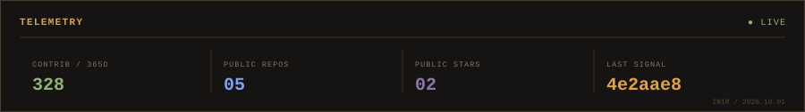
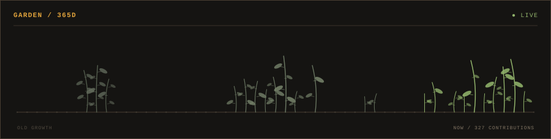
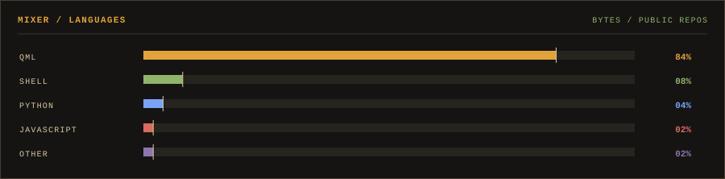

# CAM / 07

`LITTLE ENGINEER`<br>
**BUILDING THINGS THAT SHOULDN'T WORK.**

`linux / niri / obsidian / field notes / university / music`



---

## DECK / NOW

### [OSF-Atlas](https://github.com/caml07/OSF-Atlas)

An evidence-first archive of Obsidian Soundfields: transcripts, entities, locations and human-reviewed connections.

`PYTHON` · `ORIGINAL` · `★ 1`

**LAST SIGNAL**<br>
[`2cc1b77`](https://github.com/caml07/OSF-Atlas/commit/2cc1b77dd8630179289c1ba2df69a19eed5c2ac2) · `2026.09.27` · `10:15`<br>
data: complete OSF corpus 111-125

---

## GARDEN / 365D



<sub>365 contribution days → weekly stems → daily leaves. Same activity, same garden.</sub>

---

## BANK / PUBLIC

`  ○ 01` **[iNiR](https://github.com/caml07/iNiR)** `QML / FORK`
<sub>A Niri shell illogical-impulse based - with some modifications..</sub>

`▌ ● 02` **[OSF-Atlas](https://github.com/caml07/OSF-Atlas)** `PYTHON / NOW`
<sub>An evidence-first archive of Obsidian Soundfields: transcripts, entities, locations and human-reviewed connections.</sub>

`  ○ 03` **[calc-slang-for-calculator-](https://github.com/caml07/calc-slang-for-calculator-)** `PYTHON / PUBLIC`
<sub>Una calculadora hecha con flask</sub>

`  ○ 04` **[wayvibes-tui](https://github.com/caml07/wayvibes-tui)** `RUST / PUBLIC`
<sub>A native Linux terminal interface for WayVibes, built with Rust, Ratatui and Crossterm.</sub>

`  ○ 05` **[spicetify-cat-jam-synced](https://github.com/caml07/spicetify-cat-jam-synced)** `TYPESCRIPT / FORK`
<sub>A spicetify extension that lets a cat jam in sync with the beat of your music. UPDATED</sub>

---

## MIXER / LANGUAGES



---

## LOG / RECENT

```text
2026.09.27 10:15  2cc1b77  OSF-Atlas
  data: complete OSF corpus 111-125

2026.09.27 10:12  783dbf0  OSF-Atlas
  data: ingest OSF 101-110

2026.09.27 10:07  f067505  OSF-Atlas
  data: ingest OSF 091-100

2026.09.27 10:07  d18b441  OSF-Atlas
  feat: generalize source record labels

2026.09.27 09:55  98e458c  OSF-Atlas
  data: ingest OSF 081-090

2026.09.27 09:43  92276df  OSF-Atlas
  data: ingest OSF 071-080

2026.09.27 00:57  d50a9a1  OSF-Atlas
  data: ingest OSF 061-070
```

---

## LOCAL / OFF—REPO

`HOST` &nbsp;&nbsp;&nbsp;&nbsp;&nbsp; linux / niri<br>
`NOTES` &nbsp;&nbsp;&nbsp;&nbsp; obsidian / field notes<br>
`STATUS` &nbsp;&nbsp;&nbsp; university / computer science<br>
`AUDIO` &nbsp;&nbsp;&nbsp;&nbsp; usually something sad<br>
`MISC` &nbsp;&nbsp;&nbsp;&nbsp;&nbsp; things that should probably not work

---

<sub>SOURCE / GITHUB GRAPHQL + REST · REFRESH / 6H · UPDATED / 2026.10.03 · CAM / 07</sub>
